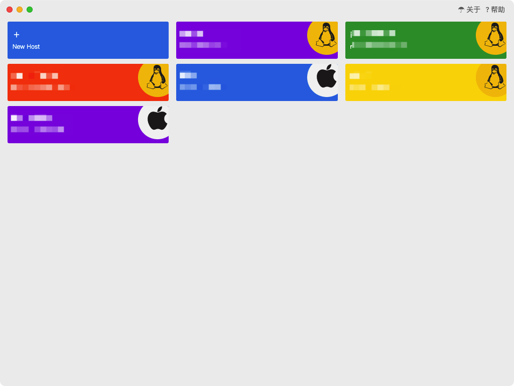
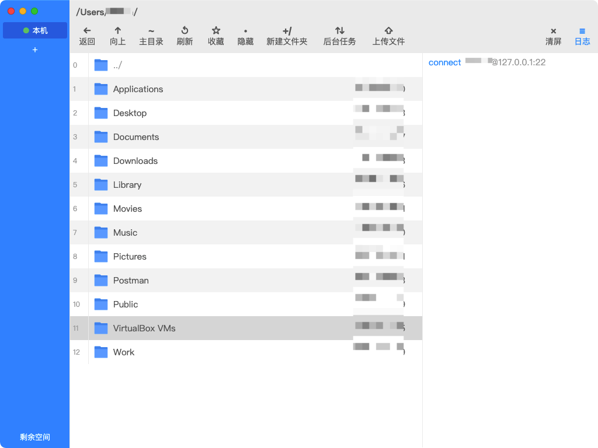

# EFTP —— 免费的SFTP客户端for Mac OS
## 安全、简洁、实用、却不简单！

1. 支持多Host

2. 支持私钥（SSH）登录

3. 支持密码（PASSWORD）登录

4. 支持上传文件夹

5. 支持上传单个/多个文件

6. 支持【拖拽】上传！！！

7. 支持下载

8. 支持删除

9. 支持收藏常用文件夹

10. 支持亮、暗主题

11. 支持自动切换主题

12. 支持详细日志。。。

13. 支持解压、压缩文件

## 截图

## 已知BUG

* 暂无重大bug

## 待开发

1. *下载进度

2. *上传进度

3. 文件图标

4. 文件列表排序

5. 文本预览、编辑

6. 视频播放

7. 音频播放

8. 多语言